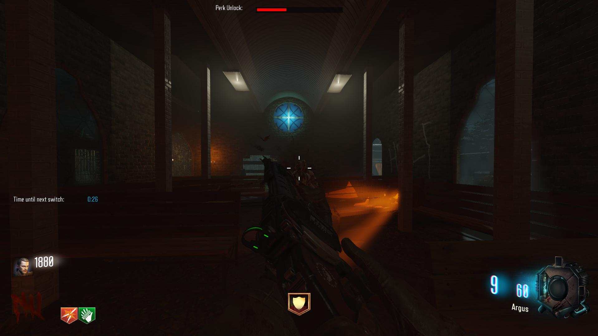

License: GNU Lesser General Public License v3.0

# UGX Mod BO3 Edition v0.1.2 alpha
UGX Mod ported to Call of Duty Black Ops 3 

UGX Mod BO3 is compatible with 99% of custom maps with (no installation necessary by the mapper).
This means you can download any map from the Steam Workshop and use UGX Mod with it right away!
UGX Mod BO3 is also fully compatible with Treyarch's DLC Maps.
It was extensively tested on Shadows of Evil but should work fine for all maps. 

# Features
* Timed Gameplay (available in all gamemodes)
* Gungame
* CHAOS Mode
* Sharpshooter

# Download/Installation
You can find UGX Mod BO3 on the [Steam Workshop](https://steamcommunity.com/sharedfiles/filedetails/?id=791127116). 

